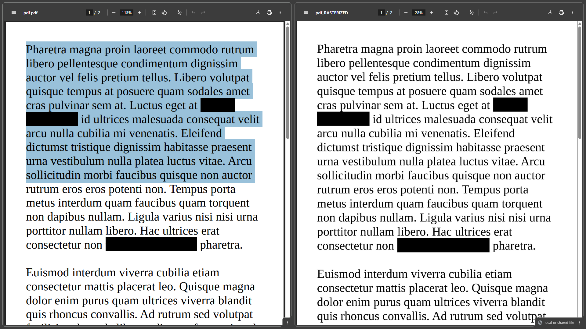
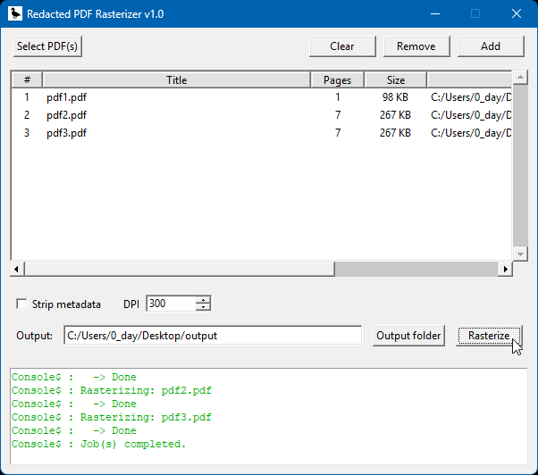

# Redacted PDF Rasterizer

A lightweight GUI application for rasterizing black-mark redacted PDF files into image-based PDFs. This tool converts PDF content into rasterized pages using Ghostscript, making the output safe from text extraction by OCR or other methods while maintaining visual quality.





## Features

- **Batch Processing**: Process multiple PDF files simultaneously
- **Adjustable DPI**: Set output quality from 72 to 1200 DPI
- **Metadata Stripping**: Optional metadata removal
- **Live Console**: Real-time processing feedback
- **File Information**: View page count and file size for each PDF
- **Easy Navigation**: Double-click to open PDFs from the file list

## Requirements

- Python 3.8 or newer
- Ghostscript (system binary)
  - **Windows**: Download from [Ghostscript Releases](https://ghostscript.com/releases/gsdnld.html)
  - Ensure the Ghostscript `bin` folder (e.g., `C:\Program Files\gs\gs10.00.0\bin`) is in your system `PATH`
- Pillow (PIL)
- PyPDF2

## Installation

### 1. Install Ghostscript

Download and install from [ghostscript.com](https://ghostscript.com/releases/gsdnld.html). On Windows, add the `bin` directory to your system `PATH`.

### 2. Install Python Dependencies

Using `requirements.txt`:

```powershell
pip install -r requirements.txt
```

Or using `pyproject.toml`:

```powershell
pip install .
```

## Usage

### Run the Application

From the project root:

```powershell
python main.py
```

### Basic Workflow

1. **Select PDFs**: Click "Select PDF(s)" or "Add" to choose one or more PDF files
2. **Configure Options**:
   - Set desired DPI (quality)
   - Optionally check "Strip metadata"
3. **Choose Output Folder**: Click "Output folder" to select where rasterized PDFs to be saved
4. **Rasterize**: Click "Rasterize" to process all selected files

## Project Structure

```
pdf-rasterizer/
├── app/
│   ├── __init__.py       # packages
│   ├── core.py           # logics  (class: PDFRasterizer)
│   └── ui.py             # GUI implementation (class: RasterizerApp)
├── assets/               # images and icons
├── main.py               # entry point
├── pyproject.toml        # project config
├── requirements.txt      # dependencies
└── README.md             # This file
```

## Configuration

### DPI Settings

- **72 DPI**: Low quality, smallest file size
- **300 DPI**: Recommended for most documents
- **600+ DPI**: High quality, larger file size

## Troubleshooting

### Ghostscript Not Found

If you see errors related to Ghostscript:
1. Verify Ghostscript is installed: `gswin64c --version`
2. Check that the `bin` folder is in your system `PATH`
3. Restart your terminal after adding to `PATH`

### PyPDF2 Import Errors

The application can work with or without PyPDF2. If unavailable, it will fall back to Ghostscript for page counting.

### Large Output Files

- Reduce DPI setting (e.g., 150 instead of 300)
- Process PDFs individually instead of batches
- Compress output PDFs using external tools

## Building Executables

To create a standalone `.exe` (requires `pyinstaller`):

```powershell
pip install pyinstaller
pyinstaller --onefile --windowed --icon=assets/icon.ico main.py
```

**License**

This project is licensed under the [MIT License](LICENSE).
